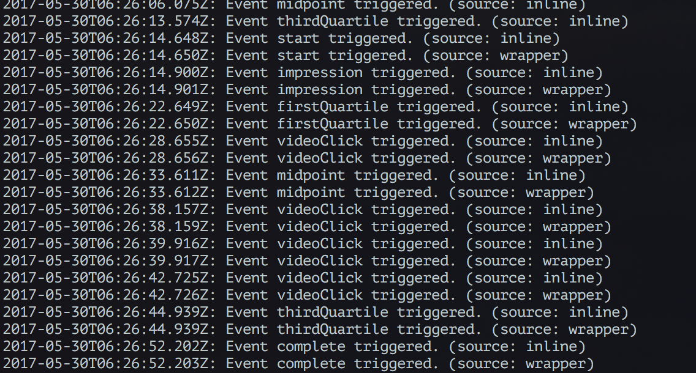

VAST Server Example
===================

HOW TO USE
----------

Have Node.js ready and then:

```
% make
% make run
```

Once the server starts listening to port 5000, go to http://googleads.github.io/googleads-ima-html5/advanced/ and:

+ try `http://localhost:5000/inline` to test inline VAST
+ try `http://localhost:5000/wrapper` to test VAST wrapper


